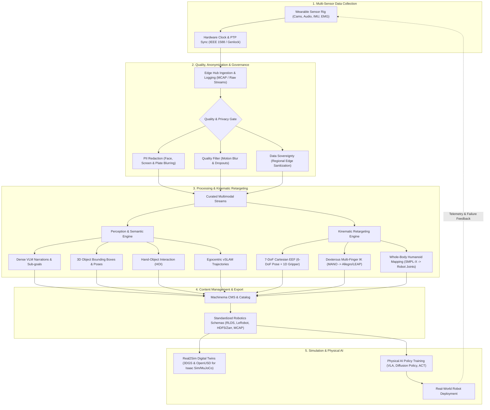

This project aims to design the system architecture of machinema, which is to connect the real world data to physical AI. Nowadays, AI is mainly used in the virtual world, but it can be used in the real world to help people with their daily lives. Also the physical world has a lot of data that can be used to train AI. The state of art of robotics is leaning toward  creating a single, **general-purpose** model trained on highly diverse data—including web data, human videos, and autonomous robot experiences—allowing it to work across various tasks and robot embodiments. 

The goal of machinema is to build a platform that can be used to collect, process, and use the real world data to train AI models. It composes 3 main components: 
1. **Data Collection**: Collect multi-sensory data from the real world, including visual, audio, tactile, force, vibration, temperature, etc. The data can be collected by human or robots. Machinema right now focuses on collecting data from human activities over the wearable devices, including cameras, microphones, IMU, EMG sensors, etc. Camera can be monocular, binocular, quadcams or even hexacams.
2. **Data Processing**: Process data to make it suitable for training AI models. Processed data including temporal actions and segmentations (these timestamped video descriptions generated by VLMs are central to modern Vision-Language-Action (VLA) models and imitation learning from human video.), object detection, hand-object interaction detection, object tracking, action recognition, hand pose estimation, object pose estimation, human body pose estimation, semantic segmentation, etc. 
3. **Model Training**: Train AI models on the processed data. The models include VLM, vSLAM, and other robotics models for different embodiment. 
4. **Content Management**: Manage the content of the data. Categories include object, action, scene, etc. Users can search the data by category, and get the data through the web interface or an API. 
5. **Other components**: 
    1. Storage: Store the raw data, processed data, and model data. 
    2. Delivery: Deliver the processed data and model data to users for training AI models. 
    3. Transfer: Transfer of data from devices to the cloud and cross-border transfer. 

---

## Detailed System Architecture & Extensions

To make Machinema an end-to-end infrastructure connecting real-world human data directly to Physical AI and general-purpose robotics, the following architectural extensions expand upon the core components above.

### 1. Hardware Synchronization & Spatial Calibration
* **Microsecond Temporal Sync:** Cameras (30–60 FPS), IMUs (200–1000 Hz), EMGs (1–2 kHz), and audio must share a unified timeline. Employs hardware Genlock, PTP (IEEE 1588), and synchronized hardware clock timestamps on the wearable edge compute hub.
* **Spatial Calibration Pipeline:** Dynamic and factory routines for intrinsic camera calibration (fisheye/pinhole) and multi-camera rig extrinsics ($T_{\text{cam}_i \to \text{cam}_j}$), as well as visual-inertial (Camera-to-IMU) calibration matrices.

### 2. Kinematic Retargeting Engine (Human-to-Robot Bridge)
Raw perception outputs describe what a human does, but physical AI requires actionable control targets ($a_t$). The retargeting engine converts tracked human kinematics into robot-executable action spaces:
* **7-DoF Cartesian End-Effector (EEF):** Maps human wrist 6-DoF trajectories into delta poses $[\Delta x, \Delta y, \Delta z, \Delta \text{roll}, \Delta \text{pitch}, \Delta \text{yaw}]$, and maps finger-pinch aperture to normalized gripper commands $[0.0, 1.0]$ for parallel-jaw grippers.
* **Dexterous Multi-Finger Retargeting:** Maps 21-joint MANO hand poses to commercial multi-finger robot hands (e.g., Allegro Hand, LEAP Hand, Shadow Hand) using constrained optimization and inverse kinematics (IK).
* **Whole-Body Humanoid Mapping:** Maps full-body motion capture / SMPL-X skeletons to bipedal humanoid degrees of freedom (e.g., Unitree, Figure, Atlas).

### 3. Data Quality Assurance & Human-in-the-Loop (HITL) Curation
* **Automated Sensor Health Filtering:** Automatic rejection of segments with severe motion blur, tracking drops, camera occlusions, or sensor packet loss.
* **VLM Hallucination & Contact Verification:** Cross-modal grounding to ensure VLM captions accurately reflect physical contact states (e.g., distinguishing near-touches from actual grasps using point tracking and optical flow).
* **HITL Web Studio:** Web-based interface for human reviewers to inspect, trim trajectory endpoints, and correct sub-goal boundaries and action labels.

### 4. Privacy, Anonymization & Data Governance
* **Automated PII Redaction:** In-stream and batch anonymization of bystander faces, vehicle license plates, computer monitors/screens, and sensitive documents. Audio de-identification and bystander speech muting.
* **Cross-Border Compliance (Data Sovereignty):** Multi-region edge architecture compliant with GDPR, CCPA, and data sovereignty laws (e.g., China PIPL/DSL). Raw video remains in-region, while sanitized, anonymized action trajectories and embeddings can be synced globally.

### 5. Standardized Robotics Data Formats & Export
To allow out-of-the-box training across open-source and proprietary robotics frameworks, data is packaged into native robotics schemas:
* **RLDS (Robot Learning Dataset Standard):** Standard format for Open X-Embodiment, Octo, and RT-2.
* **LeRobot (Hugging Face):** Native Apache Parquet + MP4 format for lightweight, community-accessible policy training.
* **HDF5 / Zarr:** High-throughput chunked formats for Diffusion Policy and Action Chunking with Transformers (ACT).
* **MCAP:** ROS 2 compatible container format for full-bandwidth multimodal sensor replay.

### 6. Simulation Bridge & Digital Twins (Real2Sim)
* **3D Scene Reconstruction:** Automatic generation of photorealistic 3D environments from wearable video passes using 3D Gaussian Splatting (3DGS) and NeRFs.
* **Physics-Ready Simulation Assets:** Automatic extraction of manipulated objects into OpenUSD and URDF assets for **NVIDIA Isaac Sim / Isaac Lab, MuJoCo, and SAPIEN**.
* **Zero-Cost Policy Evaluation:** Enables safe, accelerated simulation replay and domain randomization prior to real-world robot deployment.

### 7. Benchmarking Suite & Closed-Loop Telemetry
* **Evaluation Splits:** Standardized benchmark suites evaluating policies across unseen environments, novel object geometries, and out-of-distribution language instructions.
* **Closed-Loop Edge Runtime:** A lightweight robot deployment SDK that streams hardware execution telemetry and failure modes back to Machinema, driving active data collection loops.
